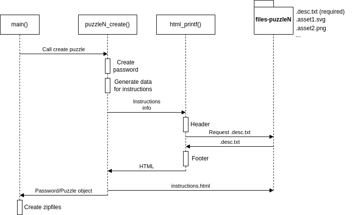
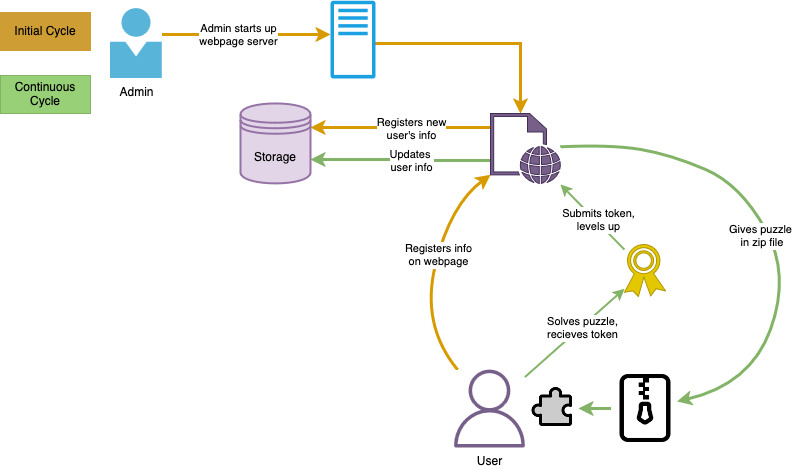

# Pointless Project 

A website to generate and distribute puzzles to prospective Lipscomb recruits.

## Introduction

> The point(less) of the *Pointless Project* is to create a compelling, puzzle-filled
> challenge inspired by the [Synacor Challenge](https://challenge.synacor.com), but targeted at a pre-college audience.
> The goal is to allow the School of Computing (SoC) to engage potential
> students during the time they are selecting a college by providing opportunities to remain in
> contact, encourage curiosity, and engage in creative problem solving while learning about
> computing and the SoC.
>
> Playing through the Synacor Challenge will provide the clearest understanding, however reading
> someone else's "[travel log](https://github.com/KanegaeGabriel/synacor-challenge/blob/master/writeup.md)" is also insightful. The key components to success include:
> 1. a personalized download containing the complete game
> 2. the ability to play completely offline
> 3. a series of different but related logic puzzles and riddles
> 4. multiple opportunities "along the way" to be recognized for their problem solving skills.

## Project Setup

### Installation

#### Linux (*recommended*)

For Debian based distributions, run:

```bash
sudo apt update
sudo apt install g++ libboost-all-dev libzip-dev php-cli gcovr
```

You will also need a way to open the zipfiles. We have found the best programs to use
are `file-roller` and `pcmanfm` (or some other file manager such as `nautilus`). But use whatever you see fit.

```bash
sudo apt update
sudo apt install file-roller pcmanfm
```

For Arch based distributions, run:

```bash
sudo pacman -S gcc boost libzip pcmanfm file-roller
```

#### Windows

For Windows, we recommend developing with [WSL](https://learn.microsoft.com/en-us/windows/wsl/about) (Windows Subsystem for Linux).
Please install it if you do not already have it using this [guide](https://learn.microsoft.com/en-us/windows/wsl/install). After that,
launch WSL and follow the steps for installing on Linux.

For viewing the zipfiles, we have found that [7-zip](https://www.7-zip.org/download.html) works best.

#### Mac

Unfortunately, we have not been able to get the project built on macOS. We have
decided the best option for Mac users is to use a virtual machine running
some Linux distribution.

Here are some popular VMs:
- [QEMU](https://www.qemu.org/) (my favorite but harder to set up)
- [VirtualBox](https://www.virtualbox.org/) (easiest but slowest)
- [VMware](https://www.vmware.com/) (high quality but paid)

There are many more out there, so choose whichever one suits you best.
Once a VM has been chosen, download the ISO for your favorite flavor of Linux,
have the VM use it, then follow the installation steps for Linux.

*Untested*: earlier versions of this project were built on Apple silicon using Homebrew under the Rosetta 2 Intel emulator:

```bash
/usr/sbin/softwareupdate --install-rosetta --agree-to-license
arch -x86_64 /bin/bash -c "$(curl -fsSL https://raw.githubusercontent.com/Homebrew/install/master/install.sh)"
brew install gcc
arch -x86_64 brew install zlib libzip boost
```

### Building

First, clone the repository if not done already:

```bash
git clone https://www.github.com/Lunatic-Labs/pointless-project.git
```

There is one `Makefile`, in `puzzle-code/`. Run `make` from there:

```bash
cd ./puzzle-code/
make <opt>
```

where `opt` is one of:
- *(none)* or `build`: build the generator, `src/main`
- `run`: build, remove old zipfiles, and run the generator from `src/`
- `test`: build and run the automated tests (see [Automated Tests](#automated-tests))
- `cleanzip`: remove all generated zipfiles and generated puzzle files
- `clean`: also remove the `build/` directory and both binaries
- `coverage`: see [Code Coverage](#code-coverage)

Object files go in `puzzle-code/build/`. Zipfiles are generated in `puzzle-code/src/zipfiles/`.
You can now inspect and solve the puzzle(s) by choosing the appropriate zipfile.

**NOTE**: The generator must be run from `puzzle-code/src/` (and the tests from `puzzle-code/tests/`),
because all resource paths are relative to it, e.g. `../html-txt/files-math/.desc.txt`. `make run` and `make test` do this for you.

`./main` accepts the following flags:
- `-s <seed>`: use the given (nonzero) seed instead of one based on the current time
- `-a`: only print the answers; do not generate any zipfiles

### Structure of Output

Upon running `./main`, the password for each puzzle is printed and the `zipfiles` directory is populated.
The entire game is `zipfiles/puzzle1.zip`, which contains the nested zipfiles `puzzle2..puzzleN`.
The other puzzles are also generated outside of `puzzle1.zip` to allow easy testing
without having to go through the entire zipfile structure.

### Repository Layout

| Path | Contents |
|------|----------|
| `puzzle-code/src/` | The C++ puzzle generator |
| `puzzle-code/tests/` | Automated tests for the generator |
| `puzzle-code/html-txt/` | Per-puzzle resource directories (`files-<name>/`) and the shared HTML header/footer (`resources/`) |
| `web-server/` | The PHP website that registers players and serves downloads |
| `imgs/` | Images used by this README |
| `ideas/` | **Not production.** Ideas and unfinished or scrapped work, kept for reference (see [ideas/README.md](ideas/README.md)) |

## Puzzle Creation Framework

There are a lot of directories in this project, and not all
of them contain code. In fact, most of these directories contain the necessary resources
for their respective puzzle.

Any directory in `puzzle-code/html-txt/` that starts with `files-` is a resource directory. It contains (at least) the `.desc.txt`
for its puzzle, as well as any supporting files that the puzzle needs (other HTML files, images, etc).

> **Any support files that are prefixed with `.` will not be included in the zipped-up
> puzzle. Files that do not have this prefix will be included in the zipfile.** Subdirectories are
> included recursively, unless their name also starts with `.`.

Each puzzle's generated HTML page (`instructions.html`) has a specific structure:

| instructions.html  |
|--------------------|
| Header (generated) |
| Body (.desc.txt)   |
| Footer (generated) |

The HTML *Header* and *Footer* are located in `puzzle-code/html-txt/resources/` and do
not need to be touched (unless changes are needed).

Below is a UML diagram of how a puzzle gets created.



## Implementing a New Puzzle

Implementing a new puzzle is incredibly easy. Here are the steps
to take when doing so.

### Puzzle Resources Directory

Start by creating a new directory in `puzzle-code/html-txt/` and name it `files-<new puzzle name>`.
Then inside of there, create a new file called `.desc.txt`. This is where the instructions,
hints, and other info about the puzzle are stored. Everything in this file will be put into an HTML file,
so make sure that it follows the HTML rules.

In order to transfer information easily from C++ to HTML/JavaScript, we use a special delimiter in this file,
namely `%DELIM`. For example, if I need to pass a password and an array that is generated in C++
into this `.desc.txt` file, I would do something like:

```html
<script>
  let password = %DELIM;
  let array = [%DELIM];
</script>
```

It is then the job of C++ to "stringify" the required information to pass to `.desc.txt`.
To make the explanation easier to follow, I will make a new puzzle called "fib",
where the point(less) of it is to have the user find the *n*th number of the Fibonacci sequence.

```bash
cd ./puzzle-code/html-txt/
mkdir files-fib && cd files-fib
echo "What is the <b>%DELIM</b>th number in the fibonacci sequence?" > .desc.txt
```

### Puzzle Implementation

Once the above step is done, create a new file called `<puzzle name>-puzzle.cpp`
in `puzzle-code/src/` and put the entrypoint of the function that will create the puzzle.
We will also need to include `./include/puzzle.h` to have access to the `Puzzle` object.

```cpp
// puzzle-code/src/fib-puzzle.cpp
#include "./include/puzzle.h"

Puzzle fib_puzzle_create(long seed)
{
  return {"../html-txt/files-fib", "", "changeme", {}}; // NOTE: "../html-txt/files-fib" is the puzzle resources directory from the previous step.
}
```

The return value of this function is a `Puzzle` object. It is defined in `src/include/puzzle.h` as:

```cpp
struct Puzzle {
  // The filepath to the appropriate directory
  // The content of the instruction.html pages
  // that contains all of the information needed
  // for the puzzle.
  std::string contents_fp;

  std::string contents_html;

  std::string password;

  std::optional<std::string> extra_info;
};
```

So we are returning a new puzzle where:
- resources = `"../html-txt/files-fib"`
- html content = `""`
- password = `"changeme"`
- extra info = None

The `contents_html` field is a string for the HTML content of the puzzle.
The `password` field is what will set the password for the next zipfile layer.
The `extra_info` field is purely for debugging and is strictly used for the side
effect of printing when running the application. Nothing that gets put into it will
be displayed/used in the final puzzle in the zipfiles.

Now it's time to actually create the solver for the puzzle. I will create a fib function that will find the number.

```cpp
// Complete source of puzzle-code/src/fib-puzzle.cpp
#include "./include/puzzle.h"
#include "./include/utils.h" // utils_rng_roll, utils_html_printf, utils_generate_file

static int fib(int n)
{
  if (n < 2) return n;
  return fib(n-1) + fib(n-2);
}

Puzzle fib_puzzle_create(long seed)
{
  // Get a random number in the range 3..=10.
  int fibnum = utils_rng_roll(3, 10, seed);

  // Get the solution to the puzzle.
  int password = fib(fibnum);

  // Generate the HTML content to be displayed to the user
  std::string html_content = utils_html_printf("Fibonacci Sequence",
                                               "../html-txt/files-fib/.desc.txt",
                                               {std::to_string(fibnum)});

  // Create the instructions.html
  utils_generate_file("../html-txt/files-fib/instructions.html", html_content);

  // Finally return the Puzzle object.
  return {"../html-txt/files-fib", html_content, std::to_string(password), {}};
}
```

Now that the implementation is done, add the signature `Puzzle fib_puzzle_create(long seed);` to `puzzle-code/src/include/puzzle.h`.
No `Makefile` changes are needed; it builds every `.cpp` file in `src/`.

### Using the Puzzle

In the `main` function in `puzzle-code/src/main.cpp`, there is some code that looks like:

```cpp
std::vector<Puzzle> puzzles = {
  math_puzzle_create(seed),
  color_puzzle_create(seed),
  pixel_puzzle_create(seed),
  maze_puzzle_create(seed),
  based_intro_puzzle_create(seed),
  encrypt_puzzle_create(seed),
  rematch_puzzle_create(seed),
  binary_addition_puzzle_create(seed),
  logicgate_puzzle_create(seed),
  bst_puzzle_create(seed),
  fin_puzzle_create(seed),
};
```

Put the new puzzle in the spot where you want it to
appear in the nested zipfiles. For example, if I want it to be the
third puzzle that the user solves, I would do:

```cpp
std::vector<Puzzle> puzzles = {
  math_puzzle_create(seed),
  color_puzzle_create(seed),
  fib_puzzle_create(seed), // Added it here
  pixel_puzzle_create(seed),
  // ...
};
```

Now run `make run` in `puzzle-code/` and these things will happen:
- The `files-<puzzle name>` directories will all generate a file called `instructions.html`.
- `puzzle-code/src/zipfiles/` will be populated with zipfiles.

Finally, add an automated test for the puzzle (see [Implementing New Tests](#implementing-new-tests)).

## Current Puzzles

These are the currently implemented puzzles. Each one has three entries.
1. *Adjustable Variables*: Variables can be adjusted to make the puzzle harder/easier
2. *Description*: What the puzzle does
3. *RNG*: What exactly in the puzzle is random

### Math

*Adjustable Variables*:
- `MATH_MIN1`
- `MATH_MAX1`
- `MATH_MIN2`
- `MATH_MAX2`

*Description*:

This puzzle serves as the *Hello, World!* puzzle. It introduces the user
to reading the description, solving the puzzle, and inputting the password.

We prompt the user to solve a very simple math question in the form of $a + b$.

*RNG*:
- $a$, $b$

### Color

*Adjustable Variables*: *None*

*Description*:

This puzzle asks the user to enter the hex value of one of Lipscomb's colors (purple or yellow).
The goal of this puzzle is to teach the user about hex values. We hope that the user does
some simple Googling to find [this website](https://teamcolorcodes.com/lipscomb-university-bisons-color-codes/) to find the colors.

*RNG*:
- purple | yellow

### Pixel

*Adjustable Variables*:
- `MAX_LOOP` (**must change number of html elements to match**)

*Description*:

The goal of this puzzle is to retest the user on their knowledge of [hexadecimal color codes](https://en.wikipedia.org/wiki/Web_colors)
learned in the "Color" puzzle. The hex codes come directly from the bison SVG included in the page's header.

The user is shown a hex code along with a number.

- `#331E54 = 66`

The number corresponds to the number of pixels of the given hex code found in the bison SVG.
Following the first code/number pair, there are two more rows. The first row will contain two hex codes, an "X" denoting multiplication, and a number.
The number is the product of the pixel counts related to the respective hex codes.

- `#F4AA00 X #331E54 = 396`

The final row contains three hex codes and a question mark. The user must find the product.

- `#FFFFFF X #F4AA00 X #000000 = ?`

*RNG*:
- The order of hex codes in the arithmetic

### Maze

*Adjustable Variables*:
- `MAZE_SIZE` (**must be an odd number**)

*Description*:

The goal of this puzzle is to teach the user about [run-length encoding](https://en.wikipedia.org/wiki/Run-length_encoding).
This encoding algorithm normally places numbers before the letters, while we expect the numbers to be after.
We do this because it more closely matches function calls in the form of $f\ x \rightarrow n$.

We randomly generate a maze as an SVG and have the user navigate it using the following rules:

| Instruction | Direction |
|-------------|-----------|
| *u*         | up        |
| *d*         | down      |
| *l*         | left      |
| *r*         | right     |

However, the answer is not just the path that you must take (*uulrrrd* for example); you must
apply the run-length encoding algorithm to it. So the answer would be: *u2lr3d*.

*RNG*:
- The maze that is presented.

### Encrypt

*Adjustable Variables*:
- `ENCR_WORDS`
- `ENCR_OPS`
- `ENCR_ROTATIONS_MIN`
- `ENCR_ROTATIONS_MAX`
- `ENCR_CHANGE_MIN`
- `ENCR_CHANGE_MAX`

*Description*:

This puzzle challenges the user to decrypt the password. We present them with
a list of steps used to encrypt it, and they must undo it to get the password.

The following things can happen:
- shift all characters by $i$ to either the right $(r)$ or left $(l)$
- swap the characters at index $j$ and $k$
- increase each **fourth** letter alphabetically by $n$.

*RNG*:
- The instructions used
- $i$, $r$, $l$, $j$, $k$, $n$

### Intro Base

*Adjustable Variables*:
- `MAX_HEX_ANS_LEN`

*Description*:

The goal of this puzzle is to introduce the player to number bases and base conversion.
The puzzle contains a visual representation of numbers with different bases called a lightbox.
Using these visual representations of bases, the player must convert a lightbox from base 16
to base 10.

*RNG*:
- the number
- lightbox placements

### Rematches

The "rematch" puzzles serve as the point in the project where there is a
noticeable difficulty spike. It interrupts the linear nested puzzle format
by having the user solve three harder versions of previous puzzles. Each one
of these rematch puzzles gives a piece of the password to advance past this
rematch section.

#### Maze Rematch

*Adjustable Variables*:
- `MAZE_SIZE` (**must be an odd number**)

*Description*:

This is the harder version of the *Maze* puzzle. We provide cryptic instructions
with the goal of having them inspect the page and navigate to the console. Once they
type "instructions" a list of function calls is presented. The user then needs to navigate
the maze $(M_1)$ using these function calls and must explore two other mazes $(M_2, M_3)$ with items that need to
be picked up. Once these items are picked up, they then need to go to $M_1$ and go
to the yellow tile. The password is then presented when they type "exit()".

*RNG*:
- $M_1, M_2, M_3$, password

#### Encrypt Rematch

*Adjustable Variables*:
- `ENCR_WORDS`

*Description*:

This is a harder version of the *Encrypt* puzzle. It presents the user with an encrypted password
as well as a *not-so-helpful-at-first* order of steps that were taken. The user must interact with
a textbox on screen and try to figure out the pattern in which the buttons mess with their input.
Once they have figured it out, they must decrypt the password.

*RNG*:
- The password

#### Based Rematch

*Adjustable Variables*:
- `CELLS` (**must modify table in .desc.txt to match**)

*Description*:

The goal of this puzzle is to teach the user about [base conversion](https://en.wikipedia.org/wiki/Positional_notation#Base_conversion).
They are given a description of three Pointless-created bases. The actual instructions follow in a story-esque fashion; here they are simplified:
- Convert values to base 10
- Sum them up for each row
- Convert the sum to base 2
- Check if LSB is on or off
- Save the resulting LSB values
- Take that base 2 number and convert it back to base 10 (the rightmost column)

They are then shown a table with values occupying each cell, except for the rightmost cell in each row.

|    |    |    |   |
|---:|---:|---:|---|
| 24 |  F |  3 | ? |
| 11 | 41 | 41 | ? |
|  A | 18 | 27 | ? |
| 35 |  F |  E | ? |

*RNG*:
- The values in each cell

### BST

*Adjustable Variables*:
- `ROOT_MIN`
- `ROOT_MAX`

*Description*:

The player is presented with a root number. The goal is to create a binary search tree (BST), and trace
the route from the root node to the destination by solving the expression set with your root number.

These are the possible expressions that can show up, with examples:
- addition: $a + b$
- subtraction: $a - b$
- multiplication: $a * b$
- division: $a / b$
- square root: $\sqrt{a}$
- comparisons: $a > b$
- hexadecimal: `FFFFFF`
- complex expression: `√?((a -/+ b) +/- (c *||/ d))`

*RNG*:
- root
- expressions in each path
- path from root → destination

### Graph Paper Robot Puzzles

The idea behind this trilogy of paper robot puzzles is that we want the player to bring out
a piece of graph paper and something to color the squares with and do this all on paper. We want to
teach the player about certain topics in the first two paper robot puzzles (state, memory, etc.) then
incorporate those ideas in the last one.

#### Binary Addition (Graph Paper Robot I)

*Adjustable Variables*:
- `TAPE_WIDTH`
- `TAPE_HEIGHT`
- `REQ_CARRIES`

*Description*:

The player is presented with a 2x12 grid of (mostly) red $(r)$ and green $(g)$ pixels. Red pixels mean 0
and green means 1. Then, following the rules in the instructions, the player should color in the correct
squares with the correct color. The idea of this puzzle is that the player is actually performing binary addition.

*RNG*:
- $r$, $g$ pixels

#### Logic Gate (Graph Paper Robot II)

*Adjustable Variables*:
- `enum Gate` (**needs implementation**)
- `input length` (unimplemented, **needs to be a power of 2**)

*Description*:

**NOTE**: This puzzle is currently in development, so the description is sparse on purpose.

The player is presented with a grid of colors $(g)$ which are (unknown to the player) logic gates.
These logic gates will be read in by the robot as instructions. The first instruction is in the bottom left.
Then the robot reads to the right, and loops back to the left when it reaches the end (like reading a book, but bottom to top).
There is another robot managing the memory, which are the colored circles $(c)$.
When the first robot reads in a gate, the memory robot pops off the two bits on the left.
The logic gate is then evaluated with those bits, and the result is pushed on the right end of memory.

The answer is every evaluation in order.

*RNG*:
- $g$, $c$

#### TODO: Graph Paper Robot III

Currently unimplemented.

## Utilities

Like the name implies, these are very helpful utility functions, declared in `puzzle-code/src/include/utils.h`
and implemented in `utils.cpp`. Feel free to add more.

### Externs

`extern uint32_t FLAGS;`

### Typedefs

`typedef std::vector<std::string> strvec_t;`

`typedef const std::string filepath_t;`

### Macros

These are bit flags for `FLAGS`.

- `ANS_ONLY`: Disables artifacts from being created
- `SET_SEED`: Whether or not to use a set seed
- `NO_HDR`: Makes it so that the header of a puzzle will not be generated
- `NO_FTR`: Makes it so that the footer of a puzzle will not be generated
- `BISON_GRID`: Makes the pixelated bison generate with a grid

### Functions

```cpp
void utils_generate_file(filepath_t filepath, std::string output_body);
```

Generates a file with the given `output_body`. Will be written to the `filepath`.

```cpp
int utils_rng_roll(int min, int max, long &seed);
```

Generates a random number between `min` and `max` inclusive using `seed`.

**NOTE**: The seed is modified by every call, so adding, removing, or reordering calls
changes every later value (and the expected passwords in the automated tests).

```cpp
int utils_roll_seed(void);
```

Rolls a seed using the current time.

```cpp
strvec_t utils_walkdir(filepath_t path);
```

Returns a vector of strings containing the names of all files in `path`.
Recursively walks all subdirectories and will ignore all files/dirs that start with `.`.

```cpp
void utils_zip_files(filepath_t out_file_name, strvec_t file_names, std::string password="");
```

Zips the given files into a single file `out_file_name` with `file_names` and the password `password`.

```cpp
std::string utils_file_to_str(filepath_t filepath);
```

Returns the contents of `filepath` as a string.

```cpp
std::string utils_html_printf(std::string title, filepath_t desc_filepath, strvec_t args);
```

Creates an HTML body. All occurrences of `%DELIM` in the text of `desc_filepath` will be
replaced with the given `args` in order. It is similar to `printf`.

**NOTE**: You can have this function not insert a header if the flag `NO_HDR` is set prior
to calling this function. The same is true for the footer if `NO_FTR` is set.

## Graphics

This section covers the utility functions dedicated to graphics, declared in `puzzle-code/src/include/graphics.h`.

**NOTE**: We have moved away from PPM files and focus more on SVGs.

### Structs

- `struct Pixel`
- `struct Image`
- `struct Svg`
- `struct Svg::Shape`
- `struct Svg::Shape::Rect` inherits `struct Svg::Shape`
- `struct Svg::Shape::Circle` inherits `struct Svg::Shape`

### Operator Overloads

```cpp
Pixel &Image::operator()(size_t i, size_t j);
```

### Functions

```cpp
Image(size_t w, size_t h);
```

Constructor for an `Image`. Sets width and height to `w` and `h` and all pixels to transparent.
Implemented in `graphics.h`.

```cpp
Svg(float w, float h);
```

Constructor for an `Svg`. Sets the width and height to `w` and `h`.
Implemented in `graphics.h`.

```cpp
template <class Shape> void Svg::add_shape(Shape shape);
```

Appends a shape to the SVG. Implemented in `graphics.h`.

```cpp
std::string Svg::build(void);
```

Returns a string of all shapes in valid SVG format to embed into HTML. Implemented in `graphics.cpp`.

```cpp
Svg::Shape::Rect(float _x, float _y,
                 float _width, float _height,
                 std::string _fill,
                 std::optional<std::string> _stroke = {},
                 std::optional<std::string> _html_classname = {});
```

Constructor for `Svg::Shape::Rect`. Implemented in `graphics.h`.

Sets the position of the shape to `_x` and `_y`, its width and height to `_width` and `_height`,
and its color to `_fill`.

Optionally can set `_stroke` (use this if you want a border) and `_html_classname` (if you want
to modify it in HTML/JS).

```cpp
Svg::Shape::Circle(float _x, float _y, float _radius, std::string _fill,
                   std::optional<std::string> _stroke = {},
                   std::optional<std::string> _html_classname = {});
```

Constructor for `Svg::Shape::Circle`. Implemented in `graphics.h`.

Sets the position of the shape to `_x` and `_y`, its radius to `_radius`,
and its color to `_fill`.

Optionally can set `_stroke` (use this if you want a border) and `_html_classname` (if you want
to modify it in HTML/JS).

```cpp
std::string Svg::Rect::make() const
```

Creates an SVG line of a `Rect`. Implemented in `graphics.cpp`.

```cpp
std::string Svg::Circle::make() const
```

Creates an SVG line of a `Circle`. Implemented in `graphics.cpp`.

```cpp
Svg graphics_gen_svg_from_image(Image &img, float pixel_size);
```

Creates an `Svg` from `img` using the scaling of `pixel_size`.

**NOTE**: all "dead" pixels are set to transparent.

```cpp
void graphics_create_ppm(Image &img, const char *filepath);
```

Creates a PPM image from `img` and saves it to `filepath`.

```cpp
Image graphics_scale_ppm(Image &img, size_t scale);
```

Scales `img` by `scale` and returns a new `Image`.

**NOTE**: This function is extremely slow as it runs in $O(n^4)$ time.

## Web Server

### Description

The main goals of the webpage are puzzle download, user registration, and user tracking.
New users put their info into the first page, which is saved to a CSV file (each new user has a default level of 0).
The user downloads the puzzle via PHP and plays offline. `download.php` builds a personalized zip on request by running the
puzzle generator (`puzzle-code/src/main -s <seed>`), where the seed is derived from the user's email using the same
formula as `seed_gen()` in `puzzle-code/tests/file.cpp` (see `web-server/includes/generate.php`).
Registered users can log in (`login.php`) to return to the download page.

Tracking progress by having users submit hidden tokens is planned but not implemented (see [ideas/tokens.md](ideas/tokens.md)).
The UML diagram below predates that decision.



### How to Start

Change directories to `web-server/`:

```bash
cd ./pointless-project/web-server
```

The download page runs the puzzle generator, so build it first (see [Building](#building)). `make` must also be
installed on the server, since every download runs `make cleanzip` in `puzzle-code/`.

```bash
make -C ../puzzle-code
```

Start localhost:

```bash
php -S localhost:8000
```

**NOTE**: Keep the terminal running to track all requests going to the web server.

**NOTE**: To use a generator in a different directory, set `POINTLESS_SRC_DIR` (e.g. `POINTLESS_SRC_DIR=/path/to/puzzle-code/src php -S localhost:8000`).
The directory above it must contain the `puzzle-code` `Makefile`.

### Integration Test Format

Tests for the webpages use bash scripting and are found in the `integrated-tests` directory.

**NOTE**: Always run these tests from the `integrated-tests` directory. This makes sure that the `cd ..` command makes the current working directory `web-server`.

To run a test, type `./the-desired-script.sh` into the terminal while in `web-server/integrated-tests`.

Naming format: `test-<webpage>-<FeatureBeingTested>.sh`

Testing format:

```bash
#!/bin/bash
cd ..
cdt=$(date +"%Y-%m-%d_%H:%M:%S")
touch ./integrated-tests/<name-of-test>-output-$cdt.txt

# run wget to perform a GET or POST request on the URL and write the result to the output file

# if-else statements to find desired outcomes using '! grep'

# delete the output file (rm ./integrated-tests/<name-of-test>-output-$cdt.txt) and any edits to the csv (sed -i '$d' ./includes/contact-data.csv)
```

**NOTE**: Whenever running tests that manipulate `contact-data.csv` in any way, shape, or form, be sure to include the following bash code.

```bash
# Placed at beginning of test: create a copy of the original data for verification
cp ./includes/contact-data.csv ./integrated-tests/original-data-$cdt.csv

# ..... test body .......

# Check integrity of contact-data.csv
if diff ./includes/contact-data.csv ./integrated-tests/original-data-$cdt.csv; then
    echo 'Changes to contact-data.csv?: No, data is intact.'
    rm ./integrated-tests/original-data-$cdt.csv
else
    echo 'Changes to contact-data.csv?: !!contact-data.csv compromised!! Check for changes!!'
fi
```

### Future Goals

- Consistent dark mode between pages

## Code Coverage

The puzzle generator and tests are compiled with `--coverage`. In `puzzle-code/`, run the generator
or the tests at least once so there is coverage data, then run `make coverage`:

```bash
cd ./puzzle-code/
make run    # and/or: make test
make coverage
```

This prints the percentage of lines executed in each source file and writes the `.gcov` files to `puzzle-code/build/src/`.

## Automated Tests

From `puzzle-code/`, run:

```bash
make test
```

This compiles the tests together with the generator's code (everything in `src/` except `main.cpp`)
into `tests/main`, then runs it from `puzzle-code/tests/`.

### Implementing New Tests

#### Test Implementation

Create a new file called `<puzzle name>-puzzle-test.cpp`
in `puzzle-code/tests/`. We will need to include `../src/include/puzzle.h` to have access to the `Puzzle` object,
and `./include/test.h` to have access to the different puzzle test functions.

```cpp
#include "./include/test.h"
#include "./include/file.h"
#include "../src/include/puzzle.h"

bool fib_puzzle_test()
{
  Puzzle test;
  std::string header_content = file_contents("../html-txt/resources/header.txt");
  std::string footer_content = file_contents("../html-txt/resources/footer.txt");
  size_t found;

  std::cout << "starting fib puzzle tests" << std::endl;
  // Different assert() tests
  std::cout << "fib puzzle test successful\n" << std::endl;

  return true;
}
```

Now it's time to create an automated test for the puzzle. I will create a fib test function to see if the fib function
works correctly. The expected passwords depend on the seed, so run `./main -a -s <seed>` in `puzzle-code/src/` to find them.

```cpp
#include <iostream>
#include <string>
#include <cassert>
#include "./include/test.h"
#include "./include/file.h"
#include "../src/include/puzzle.h"
#include "../src/include/utils.h"

bool fib_puzzle_test()
{
  Puzzle test;
  std::string header_content = file_contents("../html-txt/resources/header.txt");
  std::string footer_content = file_contents("../html-txt/resources/footer.txt");
  size_t found;

  std::cout << "starting fib puzzle tests" << std::endl;
  test = fib_puzzle_create(1);
  assert(test.password == "1");
  found = test.contents_html.find(header_content);
  assert(found != std::string::npos);
  found = test.contents_html.find(footer_content);
  assert(found != std::string::npos);

  test = fib_puzzle_create(5);
  assert(test.password == "5");
  found = test.contents_html.find(header_content);
  assert(found != std::string::npos);
  found = test.contents_html.find(footer_content);
  assert(found != std::string::npos);

  test = fib_puzzle_create(10);
  assert(test.password == "55");
  found = test.contents_html.find(header_content);
  assert(found != std::string::npos);
  found = test.contents_html.find(footer_content);
  assert(found != std::string::npos);

  test = fib_puzzle_create(15);
  assert(test.password == "610");
  found = test.contents_html.find(header_content);
  assert(found != std::string::npos);
  found = test.contents_html.find(footer_content);
  assert(found != std::string::npos);
  std::cout << "fib puzzle test successful\n" << std::endl;

  return true;
}
```

Now that the implementation is done, add the signature `bool fib_puzzle_test();` to `puzzle-code/tests/include/test.h`.

#### Using the Test

In the `main` function in `puzzle-code/tests/main.cpp`, there is some code that looks like:

```cpp
std::vector<bool> tests = {
  math_puzzle_test(),
  color_puzzle_test(),
  pixel_puzzle_test(),
  maze_puzzle_test(),
  based_intro_puzzle_test(),
  encrypt_puzzle_test(),
  rematch_puzzle_test(),
  rematch_maze_puzzle_test(),
  rematch_encrypt_puzzle_test(),
  rematch_based_puzzle_test(),
  binary_addition_puzzle_test(),
  logicgate_puzzle_test(),
  bst_puzzle_test(),
  fin_puzzle_test(),
};
```

Put the new test in the spot where you want it to
run in the testing process. For example, if I want it to be the
third test, I would do:

```cpp
std::vector<bool> tests = {
  math_puzzle_test(),
  color_puzzle_test(),
  fib_puzzle_test(),  // Added it here
  pixel_puzzle_test(),
  // ...
};
```

Now run `make test` in `puzzle-code/` and these things will happen:
- Any changed code (including `<puzzle name>-puzzle.cpp`) is compiled into `puzzle-code/build/`.
- The tests are linked into `puzzle-code/tests/main`.
- Once linked, the tests run automatically.

To run only some tests, temporarily comment out the others in the `tests` vector.

## Issues

- No support for building on macOS
- Issues with accessing the zip files on macOS and Linux without file-roller. It immediately
  prompts for a password even though it should not.
- There is no storyline.
- The puzzle difficulty does not scale smoothly. The earlier puzzles should be harder.
- The *Maze Rematch* puzzle needs a better description.
- Missing required "witty" quotes on all puzzles.
- The rematch puzzles produce "pieces" of the final password, and the user must concatenate them together. However,
  this does not work if the user decides to do them in a non-linear order. Maybe just add the numbers together?

### Questionable Items

Things found during cleanup (September 2026) that may be mistakes or leftovers. Each one needs a decision.

- **`html-txt/files-fin/fat-fat-bison.png` is unused but shipped.** The Fin puzzle's `.desc.txt` does not reference it.
  Its name doesn't start with `.`, so it is still zipped into the last puzzle. Is it a deliberate easter egg or a leftover?
- **The Fin puzzle needs the internet.** Its `.desc.txt` loads an image from `png.pngtree.com`, which breaks
  "the ability to play completely offline" and hotlinks a third-party site.
- **Player data is tracked in git and publicly downloadable.** `web-server/includes/contact-data.csv` holds names and emails.
  When the site is served from `web-server/`, anyone can fetch `/includes/contact-data.csv`.
- **The `Token` column in `contact-data.csv` is unused.** `index.php` writes `n\a` for every player (see [ideas/tokens.md](ideas/tokens.md)).
- **The Logic Gate puzzle is in the game** even though its description says "currently in development".
- **The production generator is a debug build.** It is always compiled with `-O0 --coverage`, including when the web server
  runs it, and each run tries to write `.gcda` coverage files into `puzzle-code/build/`.
- **The seed formula lives in test code.** `seed_gen()` is in `puzzle-code/tests/file.cpp`, but the copy that players actually get
  is `pointless_seed()` in `web-server/includes/generate.php`. The generator cannot derive a seed from an email itself.
- **`puzzle-code/html-txt/` is a misleading name.** It holds per-puzzle resources (including images) and templates.
  Renaming it means changing hardcoded paths in every puzzle, the tests, and the `Makefile`.
- **The page header is duplicated across PHP pages.** `index.php`, `login.php`, and `download.php` each contain their own copy of
  the header and dark-mode script, and they load Font Awesome from a CDN.
- **The UML diagrams in `imgs/` may be out of date.** They were not reviewed during cleanup.
- **`.gitignore` patterns match everywhere.** `main` and `instructions*` match files of those names at any depth.

## Future Plans

- Design Graph Paper Robot Puzzle III.
- Have an automatic emailer that sends emails to Dr. Towell.
- Have the tokens work with the website, and update the CSV file (see [ideas/tokens.md](ideas/tokens.md)).

## Contact

- Zachary Haskins - *zdhdev@yahoo.com* - [GitHub](https://github.com/malloc-nbytes/)
- Turner Austin - *tcaustin@mail.lipscomb.edu*
- Mekeal Brown - *mtbrown@mail.lipscomb.edu* - [GitHub](https://github.com/mekealbrown)
- Steven Yassa - *seyassa@mail.lipscomb.edu*
- Jordan Hasulube - *jdhasulube@mail.lipscomb.edu* - [GitHub](https://github.com/JordanHassy)
- Michael Hernandez-Lara - *mahernandezlara@mail.lipscomb.edu*
- John Tabelisma - *jmtabelisma@mail.lipscomb.edu* - [GitHub](https://github.com/johntable)
